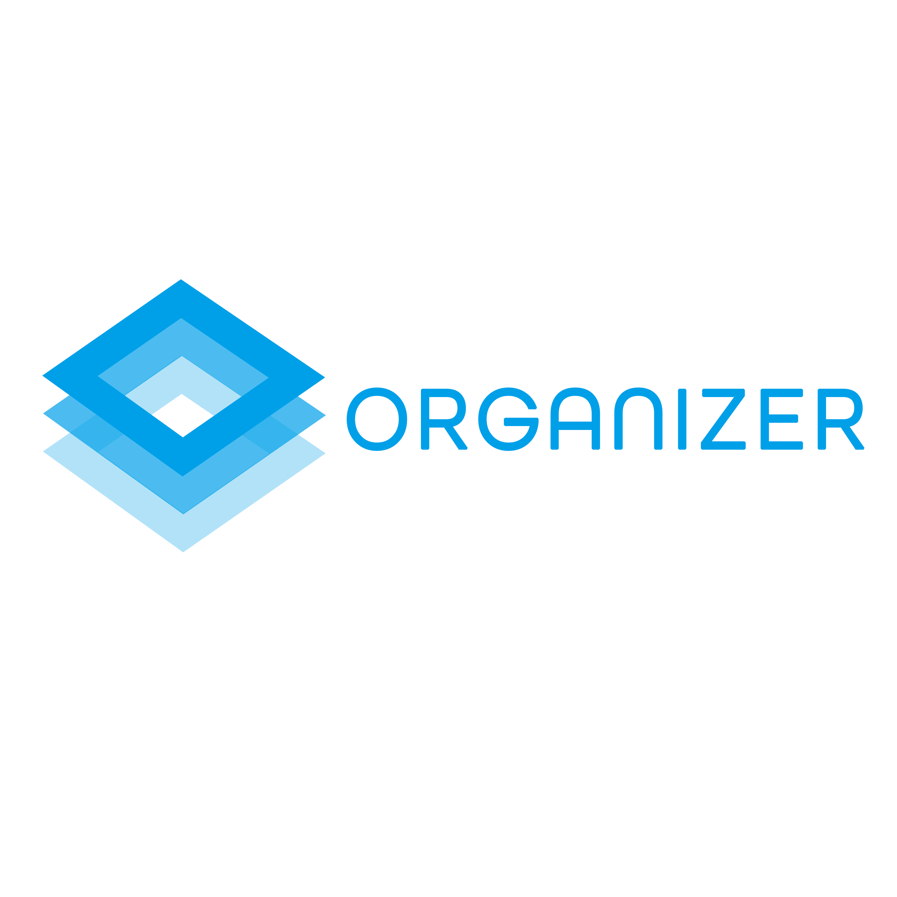

# Organizer

[](https://github.com/V2grad/Organizer) [](https://rcos.io)

Multi-semester course organizer, built with [](https://vuejs.org) and [](https://bootstrap-vue.js.org/).

Online Demo for Master Branch: https://plan.v2grad.org

We are now working with [](https://yacs.io/#/api/usage). Stay tuned for our new features with YACS, and future NYU connections.

**We LOVE feedback: open an [issue](../../issues) when you encounter a problem or confusion when using Organizer.**

## Project setup

```
yarn install
```

### Compiles and hot-reloads for development

```
yarn run serve
```

### Compiles and minifies for production

```
yarn run build
```

### Lints and fixes files

```
yarn run lint
```
