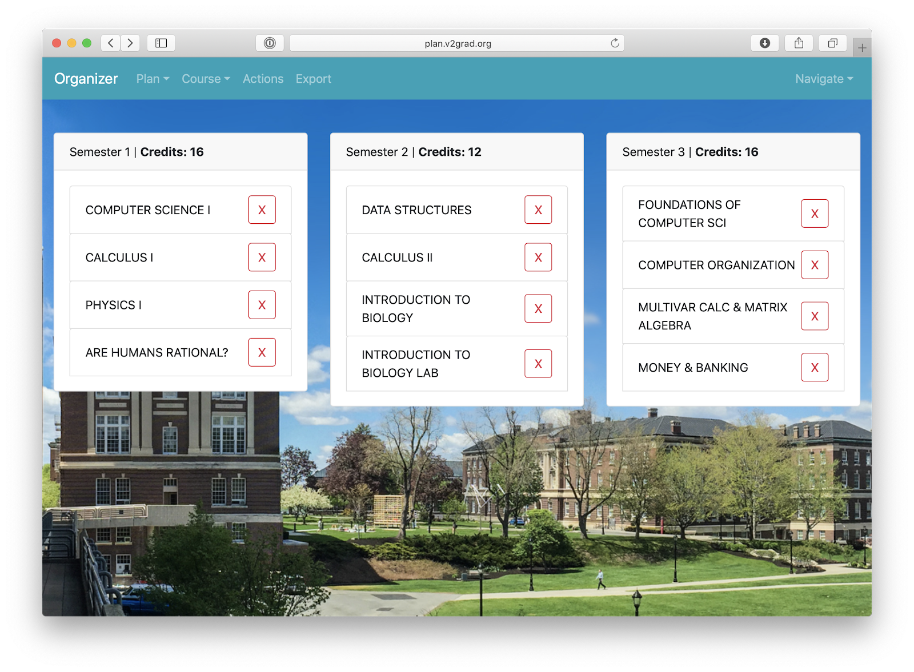
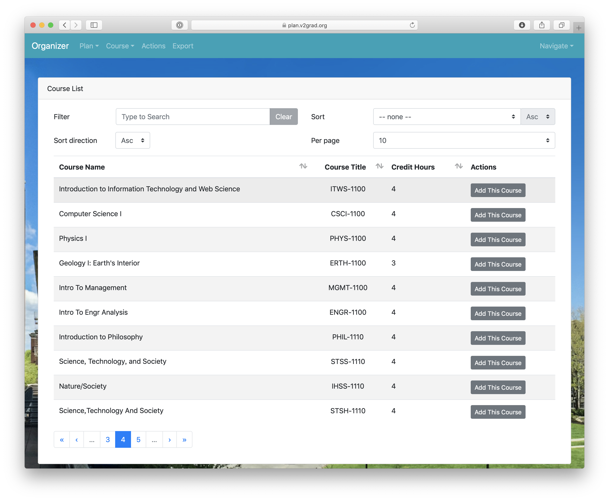
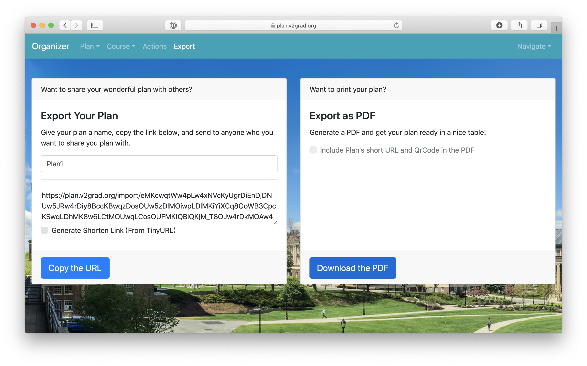

# Organizer

[](https://github.com/V2grad/Organizer) [](https://rcos.io)

Multi-semester course organizer, built with [](https://vuejs.org) and [](https://bootstrap-vue.js.org/).

Online Demo for Master Branch: https://plan.v2grad.org

**NOTE:** If you want to develop/use this project on your own, check out our [wiki](../../wiki).

We are now working with [](https://yacs.io/#/api/usage). Stay tuned for our new features with YACS, and future NYU connections.

**We LOVE feedback: open an [issue](../../issues) when you encounter a problem or confusion when using Organizer.**

## Screenshots

### Main Page



### Course List



### Export Page



## Features

- Drag and Drop to adjust courses between semesters freely.
- Mark different course in different colors.
- Allow custom courses.
- Add Transfered / AP courses
- Export to PDF.
- Share plan with short link. (Powered by TinyURL)
- Add Multiple Semesters with Oneclick.
- Allow multipule plan editing.

## Project setup

```bash
yarn install
```

### Compiles and hot-reloads for development

```bash
yarn run serve
```

### Compiles and minifies for production

```bash
yarn run build
```

### Lints and fixes files

```bash
yarn run lint
```
